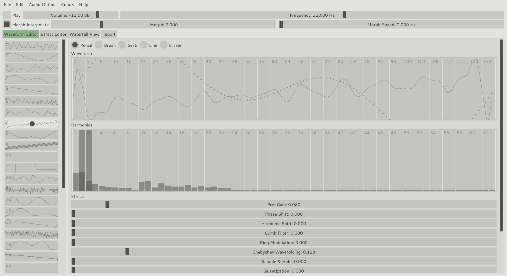

# WaveEdit for Micromonsta

WaveEdit for Micromonsta (*WaveEditMiMo*) is a fork of the cross-platform (Mac/Windows/Linux) wavetable and bank editor *WaveEdit* by Synthesis Technology. Please visit [http://synthtech.com/waveedit](http://synthtech.com/waveedit) for more information.

*WaveEditMiMo* was adapted to support the creation of wavetable banks which can be used by the [Audiothingies MicroMonsta](https://www.audiothingies.com/product/micromonsta/).

## Overview

In *WaveEditMiMo* and the Audiothingies MicroMonsta, you can load a bank of wavetables and morph/interpolate between them as they cycle at a particular frequency.

A compatible wavetable-bank need to fit the following criteria:

- A bank contains 33 wavetables
- A wavetable contains 128 samples

There are several methods for creating a bank of wavetables in *WaveEditMiMo*. You may combine any of these methods in unique ways to create your own banks.

- Draw samples on the waveform display using the drawing tools
- Draw harmonics on the spectrum display
- Load waveforms from the file menu
- Apply effects to wavetables
- Duplicate the wavetable to all slots in the bank
- Draw an effect across many wavetables in the bank
- Randomize one or all of the wavetable effects
- Import audio and stretch/crop it into adjacent wavetables

Once you are satisfied with your bank using the bank visualization pages or audio preview, you can save it as a WAV file and import it into your MicroMonsta. Please visit [Audiothingies](https://www.audiothingies.com/) if you do not already know how to import your own wavetable-banks into the MicroMonsta.

## Audio preview

At any time while using the program, you may preview the bank you are editing using the audio preview at the top of the user interface. If you have multiple audio devices on your computer, you may open the **Audio Output** menu item in the menu bar to select your preferred device.

Click the **Play** checkbox or press <SPACE> to begin previewing. The currently selected wavetable will play in a cycle at the configured **Volume** and **Frequency**.

The **Morph** slider selects the position that is being previewed. At integer positions, the exact wavetable with an index corresponding to the exact value will be played. At numbers between integers, you will hear a blend of nearby wavetables.

The **Morph Speed** slider affects the speed that the **Morph** parameter is automatically increasing. With it, you can modulate the position with a low-frequency saw wave to preview all wavetables in the bank over time.

The **Morph Interpolate** checkbox enables smooth interpolation between adjacent wavetables. Disable this to use no interpolation and instead step/glitch the waveforms as you morph through the bank.

## Pages

Immediately below the audio preview section are tabs which select the page of *WaveEditMiMo* to be displayed.

### Waveform Editor

In the Waveform Editor page, you can directly edit the samples of a wavetable, its harmonic spectrum, and the effects applied to it.

You can interact with the **Waveform** and **Harmonic** display with the mouse, using the tools listed above it.

The **Pencil** tool allows you to draw samples and harmonics directly on the displays.

The **Brush** tool smoothly adjusts adjacent samples depending on the amount of time the mouse is held.

To adjust a single sample without modifying adjacent samples, use the **Grab** tool.

Use the **Line** tool to draw a straight line by dragging and the **Erase** tool to set samples and harmonics to zero as you drag across them.

Below the Harmonic display are sliders to adjust the effect amount for the active wavetable. The meanings of the effects and effect buttons are described in the Effect Editor section.

The Waveform display shows dots at each of the exact sample values in the wavetable and lines for the bandlimited waveform after effects are applied.
The values of the dots will be saved to the WAV file during export, but the lines will be approximately what you hear at audio frequencies.
The "wiggles" are a result of the [Gibbs phenomenon](https://en.wikipedia.org/wiki/Gibbs_phenomenon) when applying a brickwall lowpass filter to the digital samples at the Nyquist frequency. This is why wavetables do not sound "stepped" when passed through a digital-to-analog converter.

When the Waveform display is modified, the Harmonic display will update, and vise-versa. The first harmonic (index 0) of the Harmonic display corresponds to the DC offset of the wavetable, which is its average vertical offset from zero.
When editing either the Waveform or Harmonic display, you are modifying pre-effect samples. If effects are applied to the wavetable, you will see "ghost" bars in the Harmonic display, representing the harmonics after post-processing is applied.

The sidebar on the left displays which wavetable is selected.
The **Morph** parameter is represented by a circle and can be dragged with the LEFT mouse button.
You can select a range of wavetables by left-clicking on the first wavetable in the desired range and <SHIFT>-clicking on the last wavetable.
right-click your selection to display a context menu with options about the active wavetable or range of wavetables.
To copy a selection of wavetables to a different location in the bank, <CTRL>-click and drag the selection in the sidebar.
double-click on a wavetable to "lock" the parameter to the nearest wavetable index.

### Effect Editor

In the Effect Editor page, you can modify in bulk the effect magnitudes of all wavetables in a bank.

For each effect, you can increase/decrease the average value of the effect magnitudes of all wavetables at once using the **Average** slider.
Beneath it, the actual magnitudes of the effect for each of the wavetables are shown in a bar display. You can edit this bar display much like in the Harmonic Editor, using the editing tools at the top of the page.
The effects are as follows.

- **Pre-Gain** applies gain to the signal before any effects are applied.
- **Phase Shift** shifts the waveform in time, which is seen as a horizontal shift in the Waveform display.
- **Harmonic Shift** rotates the phase of each harmonic equally. Like Phase Shift, this effect has no effect on sound unless effects are applied later in the effects chain.
- **Comb Filter** copies and delays the signal with feedback. This is similar to using a very short delay effect processor. The volume level may decrease significantly with this effect, depending on your waveform, so it is useful to apply pre- or post-gain or to Normalize the final signal.
- **Ring Modulation** multiplies the signal by a sine wave at an adjustable frequency.
- **Chebyshev Wavefolding** applies a modified Chebyshev function to the incoming signal, which increases the level of small samples and soft-clips large samples.
- **Sample & Hold** keeps the sample constant for an adjustable amount of time, resulting in a stepped wavetable and extra higher harmonics.
- **Quantization** reduces the bit-rate of the waveform, giving a similar stepping effect as Sample & Hold.
- **Slew Limiter** clamps the derivative of the signal to maximum and minimum values, resulting in a sort of lowpass filter in some cases and a source of higher harmonics in others (for example when slew-limiting a sine wave).
- **Lowpass Filter** applies a brickwall filter to the harmonics to filter harmonics higher than an adjustable threshold.
- **Highpass Filter** does the same but filters low harmonics.
- **Post-Gain** applies gain to the final post-processed signal.

At the bottom of the page (and on the bottom of the Waveform Editor page), a number of buttons can change the state of all effects.

- **Normalize** automatically adjusts the final gain and DC offset so that the minimum and maximum samples are at -1 and 1, respectively.
- **Cycle** removes the "jump" from the last sample to the first when the wavetable is cycled by applying a gradual slope to all of the samples.
- **Randomize** sets the effect magnitudes to random values, which can be helpful when you need inspiration.
- **Reset** sets all effect magnitudes to zero but leaves the pre-processed waveform intact.
- **Bake** applies the post-processed waveforms to become the new pre-processed waveforms, and sets all effect magnitudes to zero.

After all effects are applied to each wavetable, the post-processor checks that the values are between -1 and 1 and clips values outside that range.
Adjusting the gains or using the Normalize feature can prevent this from happening.

### Waterfall View

The Waterfall View page allows you to visualize all wavetables simultaneously in morphing mode.

The **Scale** slider adjusts the vertical exaggeration of the waterfall plot, and the **Angle** slider rotates the plot in 3D.
You can click and drag on the waterfall plot to set the Z morphing position and right-click a wave for a context menu.

### Import

The Import page is useful for creating banks based on audio files you may have in your collection.

To import an audio file, click **Browse** near the top.

Only WAV files can be selected, and they must be a reasonable length, approximately between 32 and 422400 samples
Once loaded, the waveform of the audio file will appear in the **Imported Audio Preview** display. The **Bank Preview** displays all 33 consecutive wavetables in the bank.

You can click and drag the **Imported Audio Preview** and **Bank Preview** waveforms to re-align the file, resulting in a change to the Offset parameter, explained below.

Before importing the file to your current bank, you can modify the following parameters to change the scaling and behavior of the file.

- **Gain**, **Reset Gain**, and **Normalize** adjust the volume of the audio file before importing.
- **Offset** adjusts the horizontal position of the audio file when placed in the bank.
- **Zoom** stretches the file by slowing down or speeding up the time before being placed in the bank. **Zoom 1:1** sets the zoom level to 100%, corresponding to equal-sample matching between the bank and imported audio. **Zoom Fit** sets the zoom so that the audio file stretches exactly to the size of the bank. Use **Snap to Power of 2** to lock the zoom level to ...12.5%, 25%, 50%, 100%, 200%, 400%, 800%, and so on. This is useful when importing wavetables from other software with different wavetable sizes.
- **Left Trim** and **Right Trim** cut away the imported audio by a certain amount to restrict it to a range of wavetables. Use **Snap Trim** to lock the numbers to integers corresponding to wavetable indices.

You can mix the imported audio into your existing bank with the following methods.

- **Replace All** clears the entire bank, leaving only the imported audio after clicking Import.
- **Replace Partial** clears only the portion of the bank overwritten by the audio before importing.
- **Mix** sums the existing bank wavetables with the imported audio.
- **Ring Modulate** multiplies the existing bank with the audio. Note that the wavetables outside the audio's position are cleared, since the samples are multiplied by the audio at that point, which is zero.

Finally, click **Import** to finalize the parameters to continue working on the bank in other pages, or **Clear** to unload the audio and start over.

## Key Commands

The most efficient way to use *WaveEditMiMo* is with a combination of mouse actions and key commands.
Many of these key commands are listed in the menu bar and context menu, but here is a complete list for your convenience.

| Key Command | Mac | Windows / Linux |
|---|---|---|
| New Bank | Cmd+N | Ctrl+N |
| Open Bank | Cmd+O | Ctrl+O |
| Save Bank | Cmd+S | Ctrl+S |
| Save Bank As | Cmd+Shift+S | Ctrl+Shift+S |
| Quit | Cmd+Q | Ctrl+Q |
| Undo | Cmd+Z | Ctrl+Z |
| Redo | Cmd+Shift+Z | Ctrl+Shift+Z |
| Select All Waves | Cmd+A | Ctrl+A |
| Copy Wave | Cmd+C | Ctrl+C |
| Cut Wave | Cmd+X | Ctrl+X |
| Paste Wave | Cmd+V | Ctrl+V |
| Clear Wave | Delete/Backspace | Delete |
| Randomize Effects | R | R |
| Toggle Preview Audio | Space | Space |
| Navigate Bank | Up/Down/Left/Right | Up/Down/Left/Right |
| Waveform Editor | 1 | 1 |
| Effect Editor | 2 | 2 |
| Waterfall View | 3 | 3 |
| Import | 4 | 4 |

## Reference

- original *[WaveEdit](http://synthtech.com/waveedit)* application and manual by [Synthesis Technology](http://synthtech.com/)
- [GitHub repository of *WaveEdit*](https://github.com/AndrewBelt/WaveEdit)

## Disclaimer

I created and modified this fork for my own private purposes. I assume no liability for damage caused by the use of the application.

Sebastian Kraft (spktkpkt), [*WaveEditMiMo* @ Github](https://github.com/spktkpkt/WaveEditMiMo)